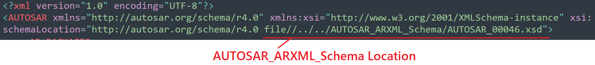
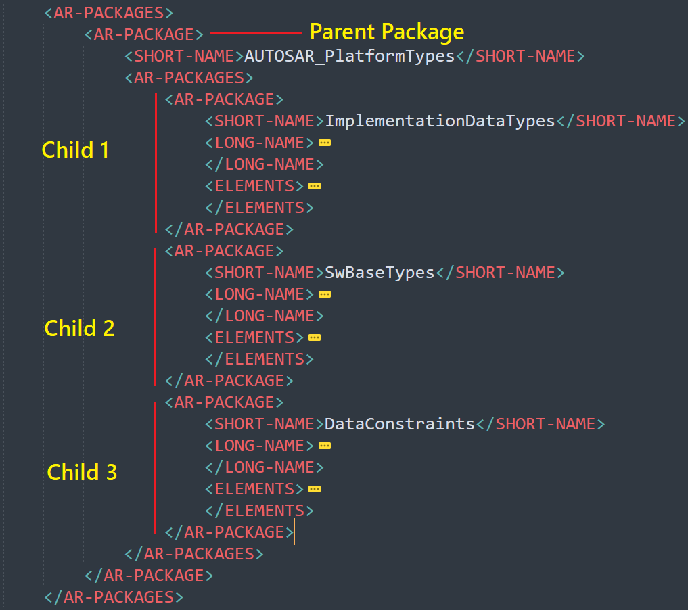
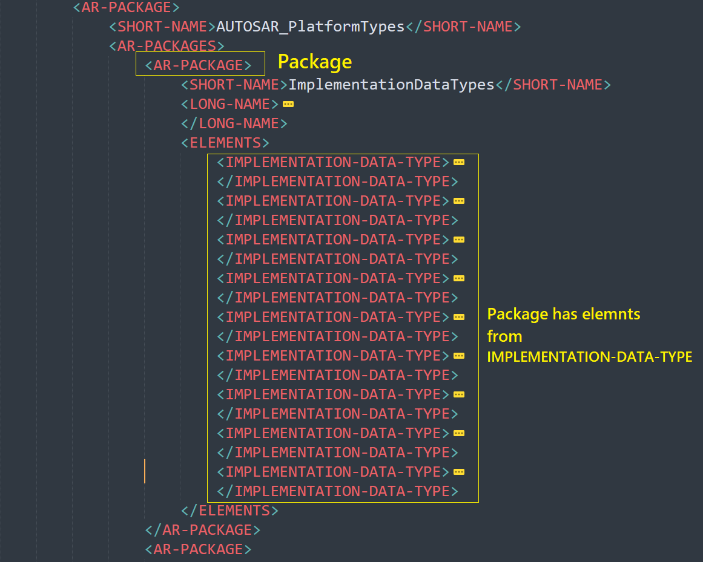
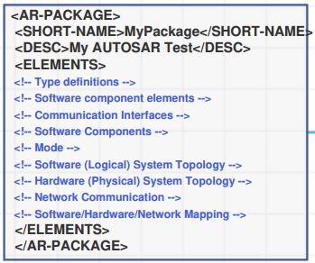
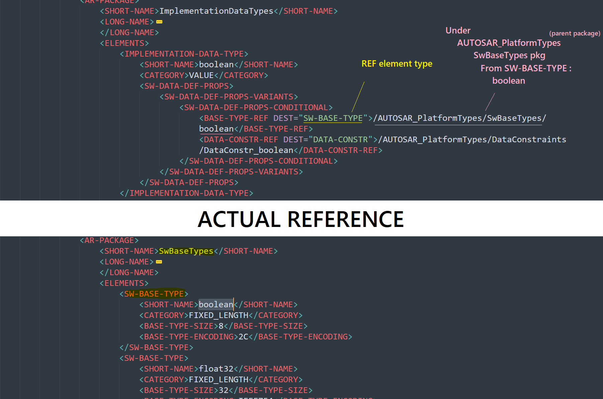

# Unit 2 - Understanding ARXML Files
## Autosar Schema
The AUTOSAR XML Schema is an XML language definition for exchanging AUTOSAR models and descriptions and the checking on ARXML file based on Autosar Schema.

## ARXML file Descriprion 
### __`Header of ARXML File`__
The AUTOSAR namespace for all AUTOSAR releases in the 4.x series is `http://autosar.org/schema/r4.0`
AUTOSAR XML descriptions (XML files describing all or part of an AUTOSAR configuration) must declare the AUTOSAR namespace as the default namespace.  
  

### __`Packages`__
 Package is a container for your elements. It can also contain sub-packages  
 Example   
 parent package is :  AUTOSAR_PlatformTypes   
 Childs            :  ImplementationDataTypes, SwBaseTypes, DataConstraints  
   

### __`Elements`__  
Elements are what you create and place in your packages.
   
 Elements may be  
   

### __`Referancing Objects`__   

## Contributing  
Bug reports, feature requests, and so on are always welcome. Feel free to leave a note in the Issues section.
