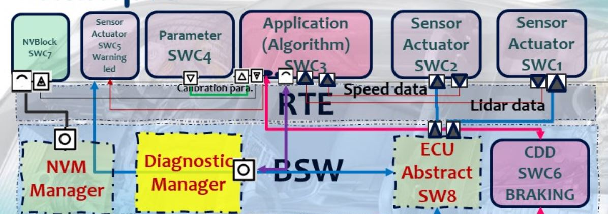
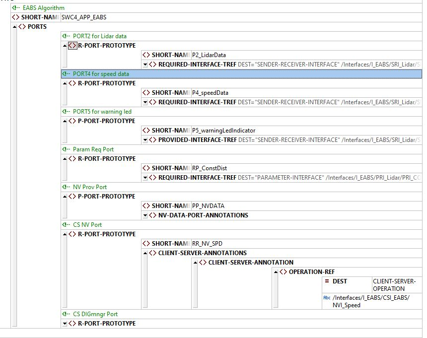

# SWCs Typs

## EABS Requirements
- Get Lidar Sensor Info
- Get Speed Sensor Info
- EABS Algo
    -   Based On Calibration data d1,d2,d3 and 0 `collision state`
    -   Warning Action
    -   Save action into NVM
    -   Report action to DEM

---

## Define Sender/Receiver Interface

---
## ARXML Output for SWC with Interfaces

---
## Contributing  
Bug reports, feature requests, and so on are always welcome. Feel free to leave a note in the Issues section.
