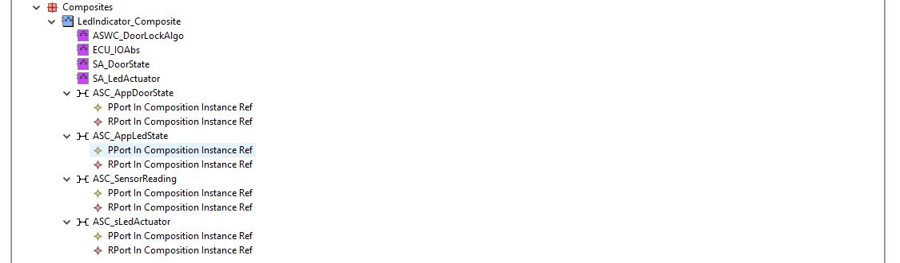

# Door Lock Indicator Project

## Objective 
This project is aimed to be familiar with `arxml` files(Read/Write) especially RTE files and dealing with authoring tool like `ARTOP(ARUNIT)` to generate RTE layer files.  
Note That:  
The project is focused on the RTE and Application layer only, so the IO Driver and the RTOS are non-autosar compliant.

---
## Project Description 
The project is about detecting if the vehicle door is opened or not and then taking action on the internal LED, if the door is opened turn on the LED, and vice versa.  
 The requirements are
- Door Sensor based on switch have two state 
    - `DOOR_CLSD` When door is closed 
        -   Logic State `HIGH`
    - `DOOR_OPND` When door is opened 
        -   Logic State `LOW`
- Led two states 
    -  `LED_OFF` to turn on LED 
    -  `LED_ON`  to turn off LED 
---
## Overview 
The idea is to isolate the application software component from the other components so separate the SWCs, One for getting the door state and provide it to application SWC and taking action on the LED by another SWC.

---
## Authoring Tool Perspective 

---
## Detailed Design
The system has separte `SWCs`  
- APPLICATION-SW-COMPONENT-TYPE: `SWC_DoorLockIndicatorAlgo`
    - Two Ports 
        - Provider Port for LED state based on `Sender/Receiver Interface`
        - Required Port for door state based on `Sender/Receiver Interface`
    - Internal Behaviour 
        - The Runnable `DoorLock_Indicator_Runnable` is based on `timing event`, so the runnable is triggered every 15ms.  

- ECU-ABSTRACTION-SW-COMPONENT-TYPE: `SWC_IO_Abstraction`  
    - Two Ports
        - Provider Port for door state based on `Sender/Receiver Interface`.
        - Provider Port for led operation based on `Client/Server Interface`.
    - Internal Behaviour 
        - Runnable 1 : `ReadDoorSensor_Runnable` is based on `timing event`, so the runnable is triggered every 10ms.
        - Runnable 2 : `LedSwitch_Runnable` is based on `OperationInvokedEvent`, so runnable is triggered if client invoked the operation.
        
- SENSOR-ACTUATOR-SW-COMPONENT-TYPE 
    -  `SWC_DoorState`
        - Ports
            - Provided Port `PP_DoorState` for send door state to APPSWC is based on `Sender/Receiver Interface`. 
            - Required Port `RP_sDoorState` for getting the door sensor reading based on `Sender/Receiver Interface`. 
        - Internal Behaviour
            - Runnable `ReadDoorState_Runnable` s based on `timing event`, so the runnable is triggered every 12ms.
    - `SWC_LED_Actuator`
        - Ports 
            - Required Port `RP_LedState` for getting led state from APPSWC is based on `Sender/Receiver Interface`. 
            - Required Port `RP_sLED_OP` for call led switch operating is based on `Client/Server Interface`. 
        - Internal Behaviour
            - Runnable `setLedState_Runnable` has `ACCESSED-VARIABLE` for `RP_LedState` (Sender/Receiver) and `SYNCHRONOUS-SERVER-CALL-POINT` for  `RP_sLED_OP` (Client/Server).
              
- COMPOSITION-SW-COMPONENT-TYPE `LedIndicator_Composite`
    - COMPONENTS 
        - ASWC_DoorLockAlgo
        - ECU_IOAbs
        - SA_DoorState
        - SA_LedActuator
    - Assembly SW Connectors 
        - `ASC_SensorReading`
            - Between `ECU_IOAbs` and `SA_DoorState`.
        - `ASC_sLedActuator`
            - Between `ECU_IOAbs` and `SA_LedActuator` 
        - `ASC_AppDoorState` 
            - Between `SA_DoorState` and `ASWC_DoorLockAlgo`
        - `ASC_AppLedState` 
            - Between `SA_LedActuator` and `ASWC_DoorLockAlgo`
             
        

---
## Minimal ARXML Perspective
 
---
## ARTOP RTE Generated Files
 

---
## Result 
GUI Description  

Output Img  

Output GIF  
 

---
## Contributing  
Bug reports, feature requests, and so on are always welcome. Feel free to leave a note in the Issues section.
