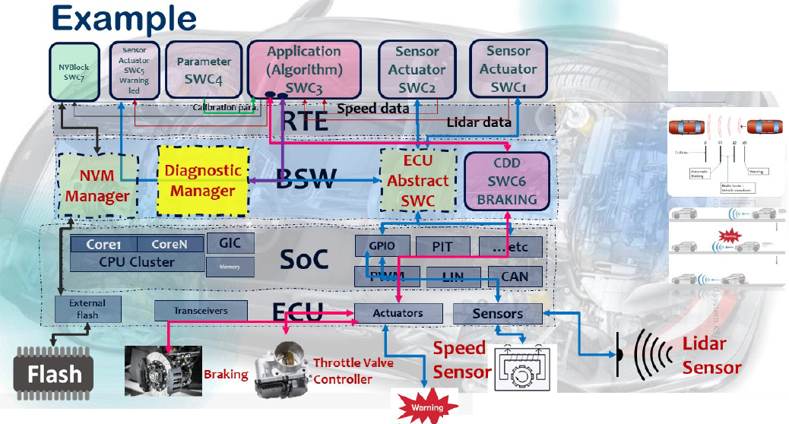
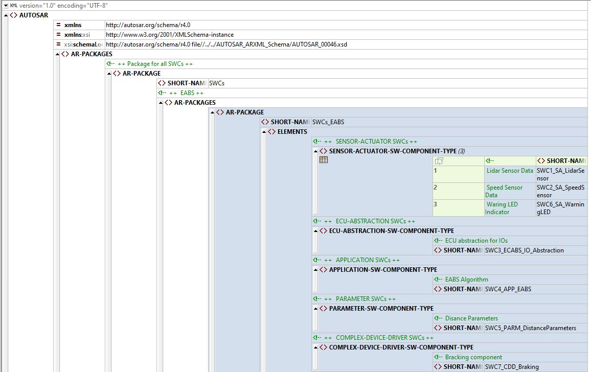

# SWCs Typs


## EABS Requirements
- Get Lidar Sensor Info
- Get Speed Sensor Info
- EABS Algo
    -   Based On Calibration data d1,d2,d3 and 0 `collision state`
    -   Warning Action
    -   Save action into NVM
    -   Report action to DEM

---

## System Overview



---
## ARXML Output for SWC Only



---
## ARXML Output AR-PACKAGE

```xml
		<AR-PACKAGE>
			<SHORT-NAME>SWCs</SHORT-NAME>
			<!-- ++  EABS ++ -->
			<AR-PACKAGES>
				<AR-PACKAGE>
					<SHORT-NAME>SWCs_EABS</SHORT-NAME>
					<ELEMENTS>
						<!-- ++ 	SENSOR-ACTUATOR SWCs ++ -->
						<SENSOR-ACTUATOR-SW-COMPONENT-TYPE>
							<!-- Lidar Sensor Data  -->
							<SHORT-NAME>SWC1_SA_LidarSensor</SHORT-NAME>
						</SENSOR-ACTUATOR-SW-COMPONENT-TYPE>
						<SENSOR-ACTUATOR-SW-COMPONENT-TYPE>
							<!-- Speed Sensor Data  -->
							<SHORT-NAME>SWC2_SA_SpeedSensor</SHORT-NAME>
						</SENSOR-ACTUATOR-SW-COMPONENT-TYPE>
						<SENSOR-ACTUATOR-SW-COMPONENT-TYPE>
							<!-- Waring LED Indicator  -->
							<SHORT-NAME>SWC6_SA_WarningLED</SHORT-NAME>
						</SENSOR-ACTUATOR-SW-COMPONENT-TYPE>
						<!-- ++ 	ECU-ABSTRACTION SWCs ++ -->
						<ECU-ABSTRACTION-SW-COMPONENT-TYPE>
							<!-- ECU abstraction for IOs  -->
							<SHORT-NAME>SWC3_ECABS_IO_Abstraction</SHORT-NAME>
						</ECU-ABSTRACTION-SW-COMPONENT-TYPE>
						<!-- ++ 	APPLICATION SWCs ++ -->
						<APPLICATION-SW-COMPONENT-TYPE>
							<!-- EABS Algorithm -->
							<SHORT-NAME>SWC4_APP_EABS</SHORT-NAME>
						</APPLICATION-SW-COMPONENT-TYPE>
						<!-- ++ 	PARAMETER SWCs ++ -->
						<PARAMETER-SW-COMPONENT-TYPE>
							<!-- Disance Parameters -->
							<SHORT-NAME>SWC5_PARM_DistanceParameters</SHORT-NAME>
						</PARAMETER-SW-COMPONENT-TYPE>
						<!-- ++ 	COMPLEX-DEVICE-DRIVER SWCs ++ -->
						<COMPLEX-DEVICE-DRIVER-SW-COMPONENT-TYPE>
							<!-- Bracking component  -->
							<SHORT-NAME>SWC7_CDD_Braking</SHORT-NAME>
						</COMPLEX-DEVICE-DRIVER-SW-COMPONENT-TYPE>
						<!-- ++ 	SERVICE SWCs ++ -->
						<SERVICE-SW-COMPONENT-TYPE>
							<!-- Diagnostics Service  -->
							<SHORT-NAME>SWC8_SRVS_DigM</SHORT-NAME>
						</SERVICE-SW-COMPONENT-TYPE>
						<!-- ++ 	COMPLEX-DEVICE-DRIVER SWCs ++ -->
						<NV-BLOCK-SW-COMPONENT-TYPE>
							<!-- NVM for FLASH  -->
							<SHORT-NAME>SWC9_NV_Flash</SHORT-NAME>
						</NV-BLOCK-SW-COMPONENT-TYPE>
					</ELEMENTS>
				</AR-PACKAGE>
			</AR-PACKAGES>
		</AR-PACKAGE>
```
---
## Contributing  
Bug reports, feature requests, and so on are always welcome. Feel free to leave a note in the Issues section.
